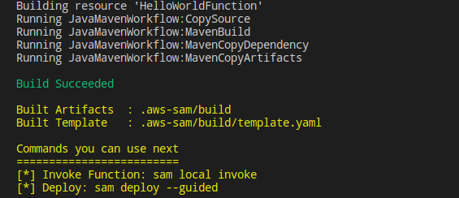

# Cookiecutter SAM for Java Lambda functions

This is a [Cookiecutter](https://github.com/audreyr/cookiecutter) template to create a Serverless Hello World App based on Serverless Application Model (SAM) and Java.

It is important to note that you should not try to `git clone` this project but use `cookiecutter` CLI instead as ``{{cookiecutter.project_name}}`` will be rendered based on your input and therefore all variables and files will be rendered properly.

## Requirements

Install `cookiecutter` command line:

**Pip users**:

* `pip install cookiecutter`

**Homebrew users**:

* `brew install cookiecutter`

**Windows or Pipenv users**:

* `pipenv install cookiecutter`

**NOTE**: [`Pipenv`](https://github.com/pypa/pipenv) is the new and recommended Python packaging tool that works across multiple platforms and makes Windows a first-class citizen.

## Usage
**Step 1: Generate a new SAM based Serverless App as follows**:

`cookiecutter gh:syumaK/cookiecutter-aws-sam-java`

OR

`sam init --location gh:syumaK/cookiecutter-aws-sam-java`

You'll be prompted a few questions such as :

`project_name [Name of the project]: `

`runtime [java8]: `

After the questionare is completed, you should see a new folder at your current path with the name of the project you gave as input.

**Step 2: Build your SAM App as follows**:

`sam build ` 

You should see output like the following after successfully building your application: 




**Step 3: Deploy your SAM App to the AWS Cloud as follows**:

```
# with sam deploy, the command will deploy and autopackage.
```
`sam deploy --s3-bucket syumak-bucket --stack-name java8-demo --capabilities CAPABILITY_IAM --region us-east-1 --profile syumaK ` 

**Step 4: Test**:

**Test locally using sam**:

`sam local invoke HelloWorldFunction --no-event` 

You should see output like the following after successfully deploying your application: 

```
Invoking helloworld.App::handleRequest (java8)

Fetching lambci/lambda:java8 Docker container image......
Mounting ......cookiecutter-Java-syumaK/.aws-sam/build/HelloWorldFunction as /var/task:ro,delegated inside runtime container
START RequestId: 68f560bd-9c2d-1ab4-f82c-f447716eb6b7 Version: $LATEST
END RequestId: 68f560bd-9c2d-1ab4-f82c-f447716eb6b7
REPORT RequestId: 68f560bd-9c2d-1ab4-f82c-f447716eb6b7  Init Duration: 938.78 ms        Duration: 2869.82 ms    Billed Duration: 2900 ms    Memory Size: 512 MB     Max Memory Used: 74 MB

{"body":"{ \"message\": \"hello world\", \"location\": \"105.226.xx.xx\" }","headers":{"X-Custom-Header":"application/json","Content-Type":"application/json"},"statusCode":200}
```


**Using Curl**:

`curl https://<restapiid>.execute-api.us-east-1.amazonaws.com/Prod/hello/`

You should see output like the following after successfully deploying your application: 

`{ "message": "hello world", "location": "54.222.000.111" }` 


# Credits

* This project has been generated with [Cookiecutter](https://github.com/audreyr/cookiecutter)


License
-------

This project is licensed under the terms of the [MIT License with no attribution](/LICENSE)
